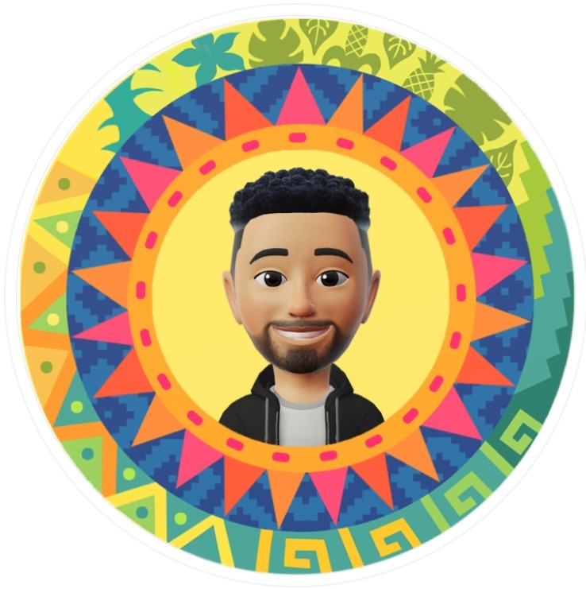

  <h1 align="center">Hi, I'm Youssef Elsheikh 👋</h1>
  
Follow Me on

  

      
      
      
    

    

    
    

  <h1>• I'm Front-End Web Developer</h1>
  <h2>• From Egypt, ِlsharqia.  • Building Useful Websites</h2>
  
  <h2>• Stacks 💻</h2>
    

      
      
      
      
    

<!-- - 🔭 I’m currently working on ...
- 🌱 I’m currently learning ...
- 👯 I’m looking to collaborate on ...
- 🤔 I’m looking for help with ...
- 💬 Ask me about ...
- 📫 How to reach me: ...
- 😄 Pronouns: ...
- ⚡ Fun fact: ...
--> -->
