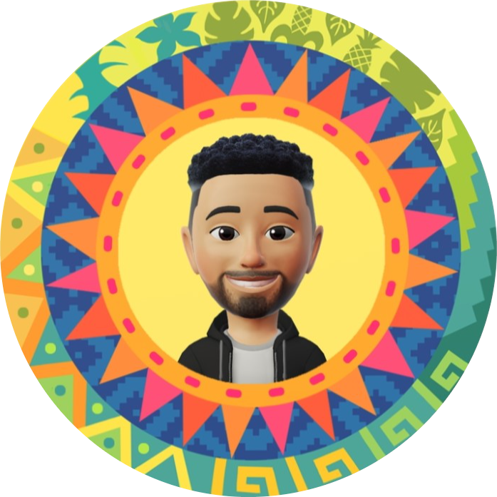

<h1 align="center">Hi, I'm Youssef Elsheikh 👋</h1>

<h3 align="center">React Frontend Developer from Cairo, Egypt 🇪🇬</h3>

I build modern, responsive, and fast web applications using React.js

Follow Me on

  
  
  

  

<h2>• About Me</h2>

<ul>
<li>💻 React Frontend Developer</li>
<li>⚡ I build responsive and modern web applications</li>
<li>🎯 Focused on clean code and reusable components</li>
<li>📍 From Cairo, Egypt</li>
</ul>

<h2>• Tech Stack 💻</h2>

  
  
  
  
  
    

